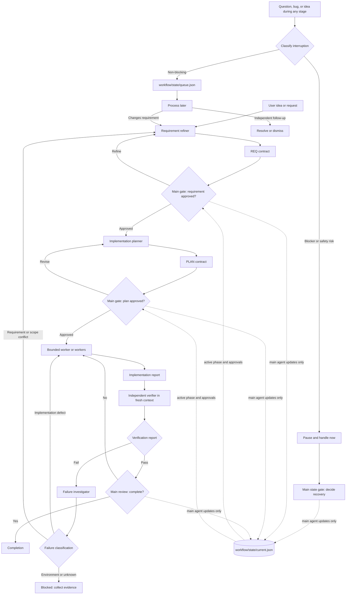

# Context-Aware Agent Workflow

This repository is a Git-versioned starter kit for a progressive-constraint workflow: the main agent owns state and decisions, while disposable specialists produce bounded evidence in clean contexts.

It is designed for four practical problems: context overload in the main chat, workflow drift from side conversations, unnecessary use of expensive agents for bounded work, and coding from unrefined abstract ideas.

## Workflow graph



The main agent is a state and decision controller, not a container for every specialist's reasoning. Specialists return compact JSON evidence; only the main agent validates it and advances `current.json`.

## Two-dice theory: shrink the possibility space

The workflow treats an abstract request as two uncertainties rolled together:

- **Intent die:** what does the user actually mean, require, and forbid?
- **Solution die:** given the real codebase, which implementation is feasible and safe?

Each contract reduces one or both uncertainties. The goal is not to predict an agent's behavior; it is to progressively narrow the freedom an implementation agent has before it writes code.

```text
Abstract idea                     intent uncertainty × solution uncertainty
        ↓ requirement refinement
Approved requirement              known intent × many possible solutions
        ↓ codebase investigation and planning
Approved plan                     known intent × bounded solution
        ↓ assigned worker task
Implementation                    one constrained change
```

If a downstream agent discovers evidence that creates new ambiguity or expands scope, it must not improvise. It writes an evidence artifact and sends the decision upward to the main gate. This keeps the conversation free to be messy while execution remains controlled.

## Core rules

- Only the main agent may approve a requirement or plan, update `current.json`, advance a phase, or declare completion.
- Workers may implement only approved, bounded tasks. Their reports are evidence, not authorization.
- Independent verification evaluates the actual diff against acceptance criteria; it does not trust implementation claims.
- Verification failures are investigated before rework, separating an implementation defect from a requirement or scope conflict.
- Non-blocking questions, bugs, and ideas go to `queue.json`; they cannot silently modify the active requirement.
- Large reasoning traces remain in artifacts. The main context receives concise conclusions and paths only.

## Repository contents

| Path | Purpose |
| --- | --- |
| [`AGENTS.md`](AGENTS.md) | Operating contract, state ownership, role boundaries, and approval gates. |
| [`skills/workflow-orchestrator`](skills/workflow-orchestrator/SKILL.md) | Coordinates state, gates, delegation, recovery, and completion. |
| [`skills/requirement-refiner`](skills/requirement-refiner/SKILL.md) | Converts vague ideas into approval-ready requirement contracts. |
| [`skills/implementation-planner`](skills/implementation-planner/SKILL.md) | Produces repository-grounded plans from approved requirements. |
| [`skills/bounded-worker`](skills/bounded-worker/SKILL.md) | Implements an approved subtask without scope drift. |
| [`skills/independent-verifier`](skills/independent-verifier/SKILL.md) | Independently verifies a change against requirements and plan. |
| [`skills/failure-investigator`](skills/failure-investigator/SKILL.md) | Routes verification failures to worker remediation or requirement refinement. |
| [`skills/stage-handoff`](skills/stage-handoff/SKILL.md) | Defines compact, machine-readable cross-context contracts. |
| [`skills/interruption-queue`](skills/interruption-queue/SKILL.md) | Classifies and records side questions, bugs, ideas, and follow-ups. |
| [`workflow/state/current.json`](workflow/state/current.json) | Small authoritative snapshot of the active workflow. |
| [`workflow/templates/`](workflow/templates) | Canonical JSON templates for requirement, plan, and reports. |

## State model

Keep three kinds of information separate:

| Layer | Purpose | Keep it small? |
| --- | --- | --- |
| Chat context | Temporary coordination and user conversation | Yes |
| `workflow/state/current.json` | What is true now: phase, approvals, next action | Yes |
| Requirement, plan, handoff, and report artifacts | Evidence, detailed findings, and history | Load only when needed |

This is controlled context rehydration: the main agent knows where information lives and loads only the artifact required for the next decision.

## Artifact flow

1. Use `workflow/templates/requirement.json` to create `workflow/requirements/REQ-###.json`.
2. After approval, create `workflow/plans/PLAN-###.json` from the plan template.
3. Assign a worker a specific task and capture its result as `workflow/reports/IMP-###.json`.
4. Independently verify it in `workflow/reports/VER-###.json`.
5. If verification fails, record the classification in `workflow/reports/INV-###.json` before routing the work.
6. Update `workflow/state/current.json` only after the main agent validates the relevant artifact.

## Delegation policy

Delegate when the work is independent, bounded, likely to fill the main context, or suitable for a lower-cost worker. Keep work with the main agent when it is small, directly tied to a current decision, or needs user approval.

The architecture does not require every role to be a separate agent on every task. The invariant is the contracts and gates, not the number of agents.

## Evaluate the workflow

Treat this as an engineering hypothesis, not a guaranteed improvement. Compare it with a normal workflow across real tasks and measure requirement failures, rework, token use, cost, latency, and completion time. Keep the structure only where it improves reliability enough to justify its overhead.
