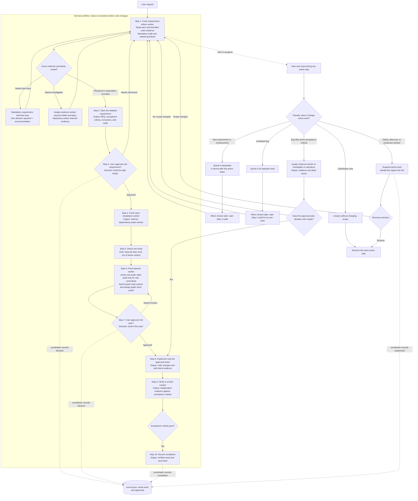

# Context-Aware Agent Workflow

This repository is a Git-versioned starter kit for a progressive-constraint workflow: the coordinator owns state and decisions, while disposable specialists produce bounded evidence in clean contexts.

It is designed for four practical problems: context overload in the main chat, workflow drift from side conversations, unnecessary use of expensive agents for bounded work, and coding from unrefined abstract ideas.

## Workflow graph



The numbered path is the normal flow. Requirement refinement, ticket breakdown,
and planning run in fresh worker contexts. The coordinator runs the mandatory
one-question-at-a-time `$requirement-interview` loop for material user decisions, summarizes
artifacts, records approval, and advances state. The lower routes show what
happens when the user interrupts it: answer a harmless clarification, queue
separate work, investigate an active-ticket failure, or suspend work for an
urgent blocker.

## Two-dice theory: shrink the possibility space

The workflow treats an abstract request as two uncertainties rolled together:

- **Intent die:** what does the user actually mean, require, and forbid?
- **Solution die:** given the real codebase, which implementation is feasible and safe?

Each contract reduces one or both uncertainties. The goal is not to predict an agent's behavior; it is to progressively narrow the freedom an implementation agent has before it writes code.

```text
Abstract idea                     intent uncertainty × solution uncertainty
        ↓ requirement refinement
Approved requirement              known intent × many possible solutions
        ↓ codebase investigation and planning
Approved plan                     known intent × bounded solution
        ↓ assigned worker task
Implementation                    one constrained change
```

If a downstream agent discovers evidence that creates new ambiguity or expands scope, it must not improvise. It writes an evidence artifact and sends the decision upward to the main gate. This keeps the conversation free to be messy while execution remains controlled.

## Core rules

- Only the coordinator may approve a requirement or plan, update `current.json`, advance a phase, or declare completion.
- Workers may implement only approved, bounded tasks. Their reports are evidence, not authorization.
- Independent verification evaluates the actual diff against acceptance criteria; it does not trust implementation claims.
- Verification failures are investigated before rework, separating an implementation defect from a requirement or scope conflict.
- Non-blocking questions, bugs, and ideas go to `queue.json`; they cannot silently modify the active requirement.
- Large reasoning traces remain in artifacts. The coordinator context receives concise conclusions and paths only.

## Mandatory research, uncertainty audit, and interview

Every root requirement begins with mandatory read-only research, audit, and
clarification. The fresh refiner studies the cited specification and only the
repository source and tests in its assigned boundary. It records concise paths,
symbols, document sections, and findings that affect intent or constraints; it
does not choose technical design. The refiner then classifies each material
uncertainty as resolved, an assumption requiring approval, needs user input, or
needs investigation. The audit covers behavior and acceptance criteria, scope
and non-goals, constraints and risks, and relevant integration, data,
permission, or migration impact.

For each material user decision, the coordinator uses `$requirement-interview` to ask one
question at a time, including a recommended answer and brief reason. After each
answer, a fresh refiner updates the requirement audit. Do not ask for facts the
refiner can discover within its boundary; assign a separate evidence worker
when research must go beyond it. The loop closes only when no material user
question remains, assumptions are explicitly approved, and every bounded
investigation has returned a conclusion; tickets and planning remain blocked
until then.

If the audit finds no material user question, record that clean result and
continue. This prevents pointless interviews while keeping clarification itself
mandatory.

The first or root requirement always receives the full audit. Tickets and
subtasks created from that approved requirement inherit it; they run a delta
audit only when planning or investigation exposes new material uncertainty.

## Coordinator and evidence workers

The coordinator is not an investigator or technical planner. It
reads user input and workflow artifacts, then routes material evidence needs to
a read-only worker. The worker receives an exact question, evidence level,
allowed sources, stop condition, and report path; it returns only evidence,
conclusion, impact, and recommended route.

Evidence levels are `requirement`, `repository`, and `external`; combine them
only when necessary. Use sources in this order: approved artifacts, repository
source and tests, then official external documentation. If the worker cannot
resolve the question within its scope, it returns a precise user question or a
blocked report rather than investigating indefinitely.

## Delivery profiles

The coordinator selects a profile at requirement approval and may revise it only
at a later gate when scope or risk changes. The profile controls how much
documentation and delegation is useful; it does not transfer state authority or
remove the need for appropriate verification.

| Profile | Use it for | Required shape |
| --- | --- | --- |
| `light` | Small, low-risk work | Fresh refiner, ticket, and plan workers produce compact artifacts; focused verification; no plan visuals unless requested. |
| `standard` | Normal product or code change | Fresh stage workers produce requirement, tickets, and selected-ticket plan; bounded implementation and independent verification; visuals when flow crosses components or is unclear. |
| `complex` | High uncertainty, significant risk, or multiple dependent tasks | Standard flow plus deeper discovery, dependency-aware tickets, extra evidence, and required plan visuals. |

## Implementation contract

Every selected-ticket plan records the existing feature or generic mechanism,
files and symbols checked, a `reuse`, `extend`, `replace`, or `create_new`
decision, and its reason. It also records acceptance-criterion references,
design trade-offs, expected files and symbols, boundaries, future posture, and
required checks. This is part of normal plan approval, not a separate gate.

Use a read-only investigation only when the planner cannot establish the
decision from repository evidence. Record a future variation only when concrete
evidence supports it; otherwise set `no_future_generalisation`. Workers choose
ordinary local names and private helpers, but return to planning for a material
change to behavior, reuse/design, API/data/permissions/migration, scope, risk,
or boundaries. Independent verification checks the whole contract.

## Plan visuals

Plan visuals help a developer approve the design before implementation; they
do not add another approval gate. Use a short code box to show the relevant
current path or symbol and the intended change. Use a small Mermaid graph to
show components and the changed control or data flow. Do not paste full files,
use a graph for a one-file local edit, or present speculative final code.

`complex` plans require both visuals. `standard` plans include them when the
change crosses components or the flow is unclear. `light` plans omit them
unless requested. Store them in `plan_visuals` in the selected ticket plan.

## Repository contents

| Path | Purpose |
| --- | --- |
| [`AGENTS.md`](AGENTS.md) | Operating contract, state ownership, role boundaries, and approval gates. |
| [`skills/workflow-orchestrator`](skills/workflow-orchestrator/SKILL.md) | Coordinates state, gates, delegation, recovery, and completion. |
| [`skills/requirement-interview`](skills/requirement-interview/SKILL.md) | Runs the mandatory one-question-at-a-time root-requirement interview in the coordinator chat. |
| [`skills/requirement-refiner`](skills/requirement-refiner/SKILL.md) | Converts vague ideas into approval-ready requirement contracts. |
| [`skills/story-breakdown`](skills/story-breakdown/SKILL.md) | Splits an approved requirement into dependency-aware tickets. |
| [`skills/implementation-planner`](skills/implementation-planner/SKILL.md) | Produces repository-grounded plans from approved requirements. |
| [`skills/bounded-worker`](skills/bounded-worker/SKILL.md) | Implements an approved subtask without scope drift. |
| [`skills/independent-verifier`](skills/independent-verifier/SKILL.md) | Independently verifies a change against requirements and plan. |
| [`skills/failure-investigator`](skills/failure-investigator/SKILL.md) | Gathers bounded evidence for failures or material uncertainty and recommends routing. |
| [`skills/stage-handoff`](skills/stage-handoff/SKILL.md) | Defines compact, machine-readable cross-context contracts. |
| [`skills/interruption-queue`](skills/interruption-queue/SKILL.md) | Classifies and records side questions, bugs, ideas, and follow-ups. |
| [`workflow/state/current.json`](workflow/state/current.json) | Small authoritative snapshot of the active workflow. |
| [`workflow/templates/`](workflow/templates) | Canonical JSON templates for requirement, plan, and reports. |

## State model

Keep three kinds of information separate:

| Layer | Purpose | Keep it small? |
| --- | --- | --- |
| Chat context | Temporary coordination and user conversation | Yes |
| `workflow/state/current.json` | What is true now: phase, approvals, next action | Yes |
| Requirement, plan, handoff, and report artifacts | Evidence, detailed findings, and history | Load only when needed |

This is controlled context rehydration: the coordinator knows where information lives and loads only the artifact required for the next decision.

## Artifact flow

1. Use `workflow/templates/requirement.json` to create `workflow/requirements/REQ-###.json`.
2. After requirement approval, a fresh `story-breakdown` worker creates dependency-aware `workflow/tickets/TICKET-###.json` artifacts.
3. Select one ticket, then a fresh planner runs a delta audit only for new material uncertainty exposed by repository inspection and creates `workflow/plans/PLAN-###.json`, including its implementation contract; obtain plan approval.
4. Assign that approved ticket to a worker and capture its result as `workflow/reports/IMP-###.json`.
5. Independently verify it in `workflow/reports/VER-###.json`.
6. If verification fails, record `workflow/reports/INV-###.json`, then repair or return to requirement approval before fresh verification.
7. Update `workflow/state/current.json` only at a state checkpoint: approval, ticket selection, investigation conclusion, verification, pause/resume, or completion.

## Fresh workers and context budget

The coordinator owns the conversation, user questions, queue, approvals, and
`current.json`; it does not execute refinement, ticket breakdown, planning,
evidence, implementation, or verification. Each of those stages starts in a
fresh worker context with only its relevant artifacts and source boundary. The
worker writes its artifact and returns a compact conclusion, risks, and next
action; the coordinator then gives the user a readable summary and approval
request rather than asking them to interpret raw JSON.

Target coordinator context below 40% of its available window. This is an
operating target rather than a reliable platform counter. At every approval,
ticket selection, investigation conclusion, implementation report, and
verification result, retain only artifact paths, approval state, unresolved
decisions, and next action in `current.json`. Keep detailed worker output on
disk. If the coordinator becomes noisy before a checkpoint, finish the worker
artifact, save the state snapshot, and continue in a fresh coordinator chat.

## Worker results

Every worker returns the same compact result: status, one-sentence summary,
exact artifact path, open decision or block, and next action. The coordinator
shows this to the user in plain language and provides both a clickable link and
the explicit relative path; users should not need to search the repository or
read raw JSON to know what requires approval.

```text
Requirement ready
Summary: Add account lockout after repeated failed sign-ins.
File: [REQ-001.json](workflow/requirements/REQ-001.json)
Path: workflow/requirements/REQ-001.json
Needs you: Approve the requirement.
Next: Start fresh story breakdown after approval.
```

## Evaluate the workflow

Treat this as an engineering hypothesis, not a guaranteed improvement. Compare each delivery profile with a normal workflow across real tasks. Measure requirement changes, rework count, failed verifications, elapsed time, token use, and agent cost. Remove or compress gates that do not improve outcomes enough to justify their overhead.
