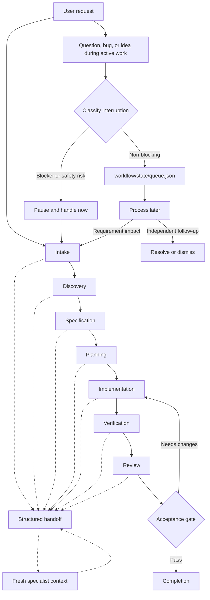

# Context-Aware Agent Workflow

This repository is a small, Git-versioned starter kit for coordinating agent work through explicit stages, clean specialist contexts, durable handoffs, and a separate interruption queue.

The design addresses a common failure mode in long agent conversations: new questions, bugs, and ideas arrive out of order and silently change the active task. The workflow keeps the active requirement stable while preserving useful side work for later processing.

## Workflow graph



Solid arrows show the normal execution path. Dashed arrows show context boundaries and structured handoffs. An interruption may re-enter intake only when investigation proves that it changes the active requirement.

## Design principles

- **Progressive constraint:** begin with intent, then progressively make the requirement, plan, and acceptance criteria more explicit.
- **Context isolation:** use fresh specialist contexts for substantial discovery, implementation, verification, or review; return concise results instead of flooding the coordinator.
- **Durable state:** store important decisions, artifacts, and follow-ups on disk so the workflow survives context compaction.
- **Explicit gates:** do not advance when a missing decision could change scope, behavior, risk, or external impact.
- **Interruption buffering:** queue non-blocking side work instead of allowing conversation order to control execution order.
- **Traceable handoffs:** every stage boundary identifies what is complete, what is known, what is unresolved, and the next concrete action.

## Repository contents

| Path | Purpose |
| --- | --- |
| [`AGENTS.md`](AGENTS.md) | Project-level operating contract for Codex and other agents. |
| [`skills/workflow-orchestrator`](skills/workflow-orchestrator/SKILL.md) | Coordinates the lifecycle, gates, context isolation, and recovery. |
| [`skills/stage-handoff`](skills/stage-handoff/SKILL.md) | Defines concise, traceable handoff artifacts between stages or agents. |
| [`skills/interruption-queue`](skills/interruption-queue/SKILL.md) | Classifies and records side questions, bugs, ideas, and follow-ups. |
| [`workflow/state/queue.json`](workflow/state/queue.json) | Durable queue state for non-blocking interruptions. |

Each skill also includes `agents/openai.yaml` metadata for user-facing skill discovery.

## Operating model

The default lifecycle is:

```text
intake -> discovery -> specification -> planning
       -> implementation -> verification -> review -> completion
```

For small, low-risk work, stages may be compressed when the omitted gate cannot change scope or correctness. The active requirement should still be stated, and the final result should distinguish completed work, verification evidence, remaining risk, and queued follow-ups.

### Interruption handling

When a side request arrives during active work:

1. Handle it immediately if it blocks progress or creates an immediate safety or data-loss risk.
2. Otherwise append it to [`workflow/state/queue.json`](workflow/state/queue.json).
3. Do not let a queued item silently change the active requirement.
4. If later investigation shows requirement impact, promote it through intake and specification before changing the plan.

### Handoff handling

When work moves to a fresh context, pass only the smallest sufficient packet: the active requirement, acceptance criteria, relevant artifacts, constraints, known risks, and next action. Store large logs and generated outputs as files; return paths and conclusions to the coordinator.

## Using this starter kit

1. Copy the `AGENTS.md`, `skills/`, and `workflow/` structure into a project or use this repository as the shared workflow layer.
2. Create a requirement ID for work that spans multiple stages.
3. Create a handoff under `workflow/handoffs/` whenever a stage or specialist context completes.
4. Keep non-blocking interruptions in `workflow/state/queue.json` and process them during a deliberate queue pass.
5. Commit meaningful workflow or contract changes so the process itself remains reviewable.

This repository contains workflow guidance and state templates; it does not prescribe a specific programming language, agent framework, or external orchestration service.
