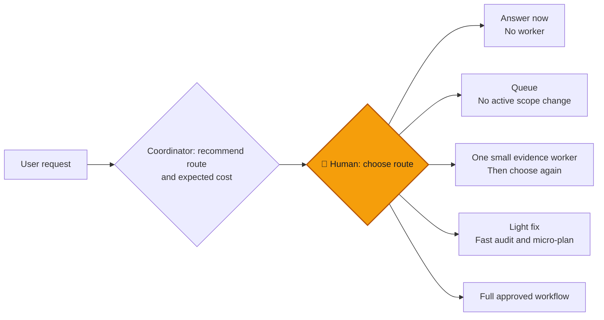
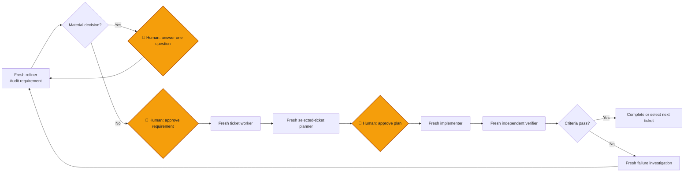

# Context-Aware Agent Workflow

A Git-versioned workflow for Codex: the coordinator owns decisions and a small
state snapshot; fresh workers do only bounded research, planning, implementation,
or verification. It is designed to reduce four common agent failures:

1. Context overload from research, logs, and repeated discussion.
2. Conversation-order drift when side requests change active work.
3. Premature coding before intent and acceptance criteria are stable.
4. Specialist work that is unbounded, forgotten, or accepted without evidence.

## Start with a developer-chosen route

The workflow does **not** automatically start a full plan. For a root
code-changing request, the coordinator recommends a route, explains the risk
and expected worker cost, then waits for the developer's choice.



| Route | Use it when | Cost control |
| --- | --- | --- |
| Answer | No code or workflow change | No worker |
| Queue | Unrelated request or bug | No active-work change |
| Investigate | A fact is unknown | One read-only, 150-word worker |
| Light fix | One clear, reversible behavior and test | Fast audit/micro-plan; stops on material risk |
| Full plan | Unclear, risky, multi-step, or cross-system work | Approved requirement, ticket, plan, implementation, verification |

`Fix now` is an explicit developer choice, not permission for the coordinator
to guess. The light route stops and recommends full planning if it exposes an
API, data, permissions, migration, security, architecture, or material scope
change.

## Full workflow



The root requirement receives a full uncertainty audit. Each uncertainty is
recorded as resolved, assumption requiring approval, needs user input, or needs
investigation. Derived tickets inherit this work and perform only a delta audit
when new evidence exposes material uncertainty.

## Two-dice theory

Every vague request rolls two uncertainties together:

- **Intent die** — what the developer means, requires, and forbids.
- **Solution die** — which implementation the real codebase can safely support.

```text
Idea                 unknown intent × unknown solution
Approved requirement known intent   × many solutions
Approved plan        known intent   × bounded solution
Approved mission     known intent   × one constrained change
```

The workflow progressively shrinks this possibility space. New evidence that
expands it returns to a decision gate rather than becoming an improvised change.

## Context and token controls

Workers receive a compact assignment: one goal, named sources and their
purpose, required artifact, input/output limits, and stop condition. They do
not receive the whole conversation, broad scans, logs, old reasoning, or a
repeated image description.

| Work | Named sources | Output target |
| --- | ---: | ---: |
| Fast evidence | 3 | 150 words |
| Requirement refinement | 5 | 250 words, one question |
| Selected-ticket plan | focused paths | 400 words |
| Verification | criteria and relevant diff | 200 words |

These are operating limits, not hard platform token caps. They control the
context supplied to workers and the reports returned to the coordinator. Keep
the coordinator under 40% context where practical by retaining only IDs, paths,
approvals, the selected route, unresolved decisions, and the next action in
[`workflow/state/current.json`](workflow/state/current.json).

Store a screenshot once as a source path. The refiner uses it for visible
layout/states, the planner uses the approved UI contract (and the image only for
pixel-level work), and the verifier uses it with approved visual criteria.

### Expected savings and trade-offs

The route gate avoids creating a refinement or planning worker for a question,
queued request, or known small fix. Named-source and report limits reduce the
largest controllable cost: repeated prompt context and long worker handoffs.
In this repository, compacting the overlapping workflow files reduced skill
instruction text from 5,458 to 3,409 words; actual token use still depends on
the model, tools, source size, and reasoning effort.

The trade-off is deliberate: a short assignment can miss a material fact. A
worker must return `blocked` and recommend a broader route rather than silently
expand its search or omit risk. Full planning remains the right choice for
uncertain, cross-system, or high-impact work; use the light route only when its
strict boundaries are genuinely true.

## UI and technical planning

Screenshots establish visible appearance, not hidden behavior. Refinement records
layout, states, accessibility, and visual checks; it asks about material
interactions, data rules, loading/error/empty states, and impractical visual
details. The selected-ticket planner translates only applicable UI/UX,
frontend, backend, and data/SQL lanes into one implementation contract.

The plan records a reuse decision, bounded mission, acceptance checks,
expected files, non-goals, trade-offs, and checks. The implementer follows:

```text
mission -> acceptance checks -> RED -> implement -> GREEN -> refactor
        -> whole-mission self-check -> independent verification
```

Use the strongest focused check when a RED test is not useful. Worker self-check
is evidence only; a fresh verifier evaluates the requirement, plan, and diff.

## Complex parallel work

Use parallel delivery only after a developer confirms a Git baseline. Plan every
ready independent slice, create one execution pack, obtain developer approval,
then dispatch isolated worktrees. Integrate verified changes in dependency order
and independently verify the integrated diff. Blocked or deferred slices never
start merely because another slice is ready.

## Repository contents

| Path | Purpose |
| --- | --- |
| [`AGENTS.md`](AGENTS.md) | Compact authority, intake, safety, and context rules. |
| [`skills/workflow-orchestrator`](skills/workflow-orchestrator/SKILL.md) | Routes work and coordinates the full workflow. |
| [`skills/requirement-refiner`](skills/requirement-refiner/SKILL.md) | Creates audited requirement contracts. |
| [`skills/requirement-interview`](skills/requirement-interview/SKILL.md) | Asks one material decision at a time. |
| [`skills/story-breakdown`](skills/story-breakdown/SKILL.md) | Creates dependency-aware tickets. |
| [`skills/implementation-planner`](skills/implementation-planner/SKILL.md) | Produces a selected-ticket plan. |
| [`skills/bounded-worker`](skills/bounded-worker/SKILL.md) | Implements one approved mission. |
| [`skills/independent-verifier`](skills/independent-verifier/SKILL.md) | Verifies independently. |
| [`skills/failure-investigator`](skills/failure-investigator/SKILL.md) | Finds bounded evidence for a failure. |
| [`skills/parallel-execution-pack`](skills/parallel-execution-pack/SKILL.md) | Prepares safe complex-work execution batches. |
| [`skills/interruption-queue`](skills/interruption-queue/SKILL.md) | Records side requests without scope drift. |
| [`skills/stage-handoff`](skills/stage-handoff/SKILL.md) | Passes concise durable evidence between stages. |
| [`workflow/templates/worker-assignment.json`](workflow/templates/worker-assignment.json) | Source, output, and stop-condition budget for workers. |

## Evaluate it

Treat the workflow as a testable hypothesis. Compare it with ordinary delivery
on a few representative requests: a question, a small known bug, an uncertain
bug, and a multi-ticket feature. Record route chosen, workers used, sources
passed, report length, rework, verification failures, elapsed time, and any
unnecessary gate. Remove a gate or reduce a budget when it does not improve the
result.
