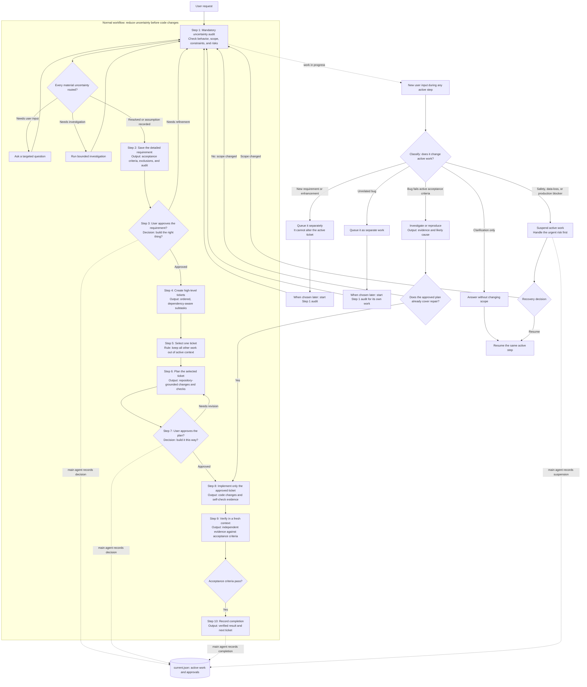

# Context-Aware Agent Workflow

This repository is a Git-versioned starter kit for a progressive-constraint workflow: the main agent owns state and decisions, while disposable specialists produce bounded evidence in clean contexts.

It is designed for four practical problems: context overload in the main chat, workflow drift from side conversations, unnecessary use of expensive agents for bounded work, and coding from unrefined abstract ideas.

## Workflow graph



The numbered path is the normal flow. The lower routes show what happens when the user interrupts it: answer a harmless clarification, queue separate work, investigate an active-ticket failure, or suspend work for an urgent blocker. The main agent alone records each state change.

## Two-dice theory: shrink the possibility space

The workflow treats an abstract request as two uncertainties rolled together:

- **Intent die:** what does the user actually mean, require, and forbid?
- **Solution die:** given the real codebase, which implementation is feasible and safe?

Each contract reduces one or both uncertainties. The goal is not to predict an agent's behavior; it is to progressively narrow the freedom an implementation agent has before it writes code.

```text
Abstract idea                     intent uncertainty × solution uncertainty
        ↓ requirement refinement
Approved requirement              known intent × many possible solutions
        ↓ codebase investigation and planning
Approved plan                     known intent × bounded solution
        ↓ assigned worker task
Implementation                    one constrained change
```

If a downstream agent discovers evidence that creates new ambiguity or expands scope, it must not improvise. It writes an evidence artifact and sends the decision upward to the main gate. This keeps the conversation free to be messy while execution remains controlled.

## Core rules

- Only the main agent may approve a requirement or plan, update `current.json`, advance a phase, or declare completion.
- Workers may implement only approved, bounded tasks. Their reports are evidence, not authorization.
- Independent verification evaluates the actual diff against acceptance criteria; it does not trust implementation claims.
- Verification failures are investigated before rework, separating an implementation defect from a requirement or scope conflict.
- Non-blocking questions, bugs, and ideas go to `queue.json`; they cannot silently modify the active requirement.
- Large reasoning traces remain in artifacts. The main context receives concise conclusions and paths only.

## Mandatory uncertainty audit

Clarification is mandatory, but asking a question is not automatic. Before a
requirement can move forward, classify each material uncertainty as resolved,
an assumption requiring approval, needs user input, or needs investigation. The
audit covers behavior and acceptance criteria, scope and non-goals, constraints
and risks, and relevant integration, data, permission, or migration impact.

Do not advance merely because the agent cannot think of another question. A
material unknown must be resolved, recorded as an approval-needed assumption,
or routed to targeted user input or bounded investigation.

## Delivery profiles

The main agent selects a profile at requirement approval and may revise it only
at a later gate when scope or risk changes. The profile controls how much
documentation and delegation is useful; it does not transfer state authority or
remove the need for appropriate verification.

| Profile | Use it for | Required shape |
| --- | --- | --- |
| `light` | Small, low-risk work | One compact ticket and plan; focused verification; subagents only when useful. |
| `standard` | Normal product or code change | Requirement, tickets, selected-ticket plan, bounded implementation, independent verification. |
| `complex` | High uncertainty, significant risk, or multiple dependent tasks | Standard flow plus deeper discovery, dependency-aware tickets, and extra evidence where needed. |

## Implementation contract

Every selected-ticket plan records the existing feature or generic mechanism,
files and symbols checked, a `reuse`, `extend`, `replace`, or `create_new`
decision, and its reason. It also records acceptance-criterion references,
design trade-offs, expected files and symbols, boundaries, future posture, and
required checks. This is part of normal plan approval, not a separate gate.

Use a read-only investigation only when the planner cannot establish the
decision from repository evidence. Record a future variation only when concrete
evidence supports it; otherwise set `no_future_generalisation`. Workers choose
ordinary local names and private helpers, but return to planning for a material
change to behavior, reuse/design, API/data/permissions/migration, scope, risk,
or boundaries. Independent verification checks the whole contract.

## Repository contents

| Path | Purpose |
| --- | --- |
| [`AGENTS.md`](AGENTS.md) | Operating contract, state ownership, role boundaries, and approval gates. |
| [`skills/workflow-orchestrator`](skills/workflow-orchestrator/SKILL.md) | Coordinates state, gates, delegation, recovery, and completion. |
| [`skills/requirement-refiner`](skills/requirement-refiner/SKILL.md) | Converts vague ideas into approval-ready requirement contracts. |
| [`skills/implementation-planner`](skills/implementation-planner/SKILL.md) | Produces repository-grounded plans from approved requirements. |
| [`skills/bounded-worker`](skills/bounded-worker/SKILL.md) | Implements an approved subtask without scope drift. |
| [`skills/independent-verifier`](skills/independent-verifier/SKILL.md) | Independently verifies a change against requirements and plan. |
| [`skills/failure-investigator`](skills/failure-investigator/SKILL.md) | Routes verification failures to worker remediation or requirement refinement. |
| [`skills/stage-handoff`](skills/stage-handoff/SKILL.md) | Defines compact, machine-readable cross-context contracts. |
| [`skills/interruption-queue`](skills/interruption-queue/SKILL.md) | Classifies and records side questions, bugs, ideas, and follow-ups. |
| [`workflow/state/current.json`](workflow/state/current.json) | Small authoritative snapshot of the active workflow. |
| [`workflow/templates/`](workflow/templates) | Canonical JSON templates for requirement, plan, and reports. |

## State model

Keep three kinds of information separate:

| Layer | Purpose | Keep it small? |
| --- | --- | --- |
| Chat context | Temporary coordination and user conversation | Yes |
| `workflow/state/current.json` | What is true now: phase, approvals, next action | Yes |
| Requirement, plan, handoff, and report artifacts | Evidence, detailed findings, and history | Load only when needed |

This is controlled context rehydration: the main agent knows where information lives and loads only the artifact required for the next decision.

## Artifact flow

1. Use `workflow/templates/requirement.json` to create `workflow/requirements/REQ-###.json`.
2. After requirement approval, create dependency-aware `workflow/tickets/TICKET-###.json` artifacts.
3. Select one ticket, repeat the uncertainty audit after repository inspection, and create its `workflow/plans/PLAN-###.json` artifact, including its implementation contract; obtain plan approval.
4. Assign that approved ticket to a worker and capture its result as `workflow/reports/IMP-###.json`.
5. Independently verify it in `workflow/reports/VER-###.json`.
6. If verification fails, record `workflow/reports/INV-###.json`, then repair or return to requirement approval before fresh verification.
7. Update `workflow/state/current.json` only at a state checkpoint: approval, ticket selection, investigation conclusion, verification, pause/resume, or completion.

## Delegation policy

Delegate only when the work needs independent evidence, is safely independent, or would fill the main context. Keep work with the main agent when it is small, directly tied to a current decision, or needs user approval.

The architecture does not require every role to be a separate agent on every task. The invariant is the contracts and gates, not the number of agents.

## Evaluate the workflow

Treat this as an engineering hypothesis, not a guaranteed improvement. Compare each delivery profile with a normal workflow across real tasks. Measure requirement changes, rework count, failed verifications, elapsed time, token use, and agent cost. Remove or compress gates that do not improve outcomes enough to justify their overhead.
